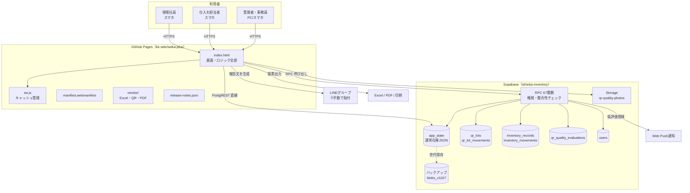
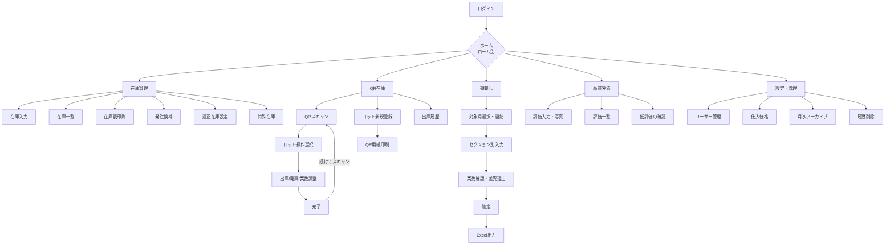
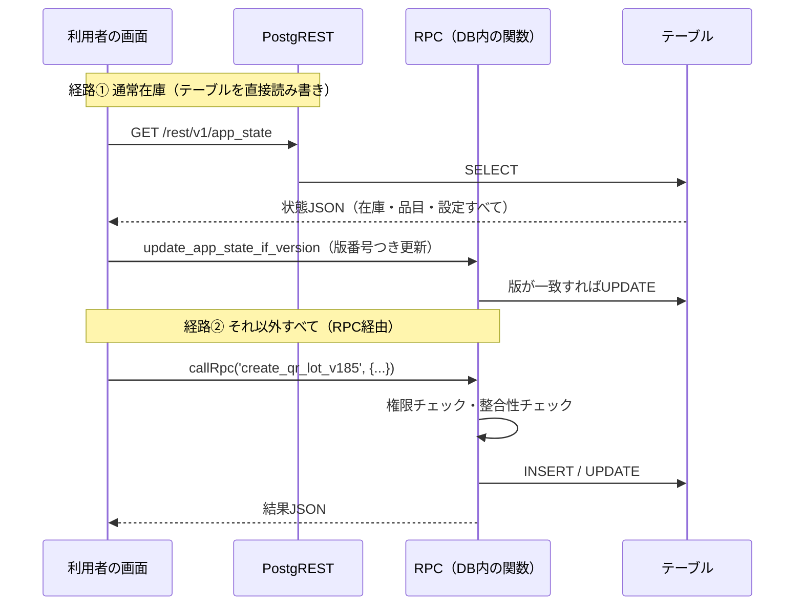
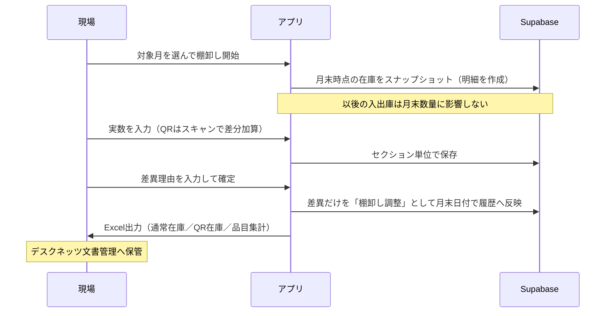
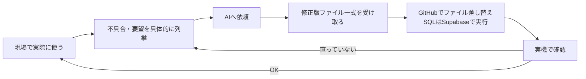

# SEIKA＋ 開発記録・仕様書

石岡青果センター 在庫管理アプリ

| 項目 | 内容 |
|---|---|
| 対象バージョン | v1.192（2026-09-01 時点） |
| 本書作成日 | 2026-09-02 |
| 作成方法 | v1.192 の `index.html` 実体と、開発チャット全履歴（2026-07-08〜2026-09-01、計4,200件超）を解析して作成 |
| 想定読者 | 引き継ぐ開発者・情報システム担当・後任の管理者 |

---

## 0. 最初に読む人へ（3分で全体像）

**SEIKA＋は、青果センターの在庫を全員が同じ画面で見て、仕入れ担当者への過不足連絡を自動化するための社内アプリです。**

技術的には、たった3つを押さえれば動きが分かります。

1. **画面はぜんぶ `index.html` 1ファイル**（約10,700行・1.4MB）に入っている。JavaScriptのフレームワークは使っていない。80個の画面関数を切り替えて表示する自作SPA。
2. **データはSupabase（PostgreSQL）にある**。通常在庫は `app_state` という1行のJSONに丸ごと入り、QRロット・品質評価・棚卸しなどは専用テーブル＋67個のRPC（DB内の関数）で扱う。
3. **公開はGitHub Pages**。`kk-seki/seika-plus` の `main` ブランチにファイルを置けば、そのまま本番に出る。ビルド工程はない。

そして、**引き継ぎで一番ハマるのがこれです。**

> 関数名・RPC名の先頭や末尾についている `v188` `v1159` などの数字は、**その機能が入ったバージョン番号**です。
> 古い世代の関数も消さずに残っているため、「同じような名前の関数が3つある」ことが普通にあります。
> **直す前に必ず全文検索して、いま実際に呼ばれている世代を特定してください。**（詳細は 5.1）

---

## 1. アプリの目的と概要

### 1.1 なぜ作ったか（当初の課題）

開発の出発点は、2026-07-08 のこの一言でした。

> 「作りたいのは在庫管理についてで、適正在庫を設定して過不足があるとLINEと連動して仕入れ担当者に連絡が行くシステムを作りたい。」

その2日後、目的はより具体的に整理されています。

| 当時の課題 | 具体的に何が問題だったか |
|---|---|
| 連絡のタイムロス | 仕入れ担当への在庫過不足の連絡を、毎回LINEに**手打ち**していた |
| 抜け漏れ | 手打ちだと「多い／少ない」の品目が抜ける |
| 個人差 | 判断する人によって報告内容がばらつく |
| 判断の不安 | 仕入れ担当者が在庫の実態を確認できず、発注判断が読みになる |
| 費用 | 既存の有料システムの月額費用を抑えたい |

**したがってこのアプリの本質的な目的は「在庫を記録すること」ではなく、「仕入れ判断に必要な情報を、抜けなく・個人差なく・すぐ届けること」です。**
機能追加を判断するときは、この目的に照らして考えてください。記録は手段であって目的ではありません。

### 1.2 基本情報

| 項目 | 内容 |
|---|---|
| アプリ名 | SEIKA＋（セイカプラス）※「青果」と「成果」をかけた命名。2026-07-14 決定 |
| 利用者 | 石岡青果センター 社員・仕入れ担当者・事務員（約20名） |
| 端末 | スマートフォン中心（iPhone / Safari）、PC・タブレットも可 |
| 提供形態 | PWA（ホーム画面に追加してアプリのように使う）／ブラウザからも可 |
| 公開URL | `https://kk-seki.github.io/seika-plus/` |
| ソース | GitHub `kk-seki/seika-plus`（デフォルトブランチ `main`） |
| データベース | Supabase プロジェクト `ishioka-inventory`（PostgreSQL・東京リージョン・Freeプラン） |
| 費用 | 現状ゼロ円（GitHub Pages無料枠＋Supabase無料枠） |
| 本格運用開始 | 2026-08-10 の利用者説明会以降 |

### 1.3 使用技術

| 層 | 使っているもの | 補足 |
|---|---|---|
| 画面 | 素のHTML / CSS / JavaScript（`index.html` 1ファイル） | React等のフレームワークもビルドツールも**不使用** |
| PWA | `sw.js`（Service Worker）＋ `manifest.webmanifest` | オフライン表示とホーム画面追加のため |
| DB | Supabase（PostgreSQL）＋ PostgREST ＋ RPC | 業務ロジックの多くはDB側の関数に置いている |
| ファイル保管 | Supabase Storage バケット `qr-quality-photos` | 品質評価の写真 |
| ホスティング | GitHub Pages | ビルドなし。ファイルを置けば公開 |
| 外部ライブラリ（`vendor/` に同梱） | `xlsx-js-style-1.2.0` / `exceljs-4.4.0` / `html5-qrcode-2.3.8` / `html2canvas-1.4.1` / `jspdf-2.5.1` | Excel出力・QR読取・画像化・PDF出力。**CDNではなくリポジトリに同梱**（社内ネットワークやオフライン耐性のため） |

### 1.4 開発の経緯（時系列）

このアプリは一気に設計されたものではなく、**現場で使いながら約2か月で積み上げたもの**です。なぜ今の形なのかを理解するには、この流れを知るのが近道です。

| 時期 | 出来事 | 何が決まったか |
|---|---|---|
| 2026-07-08 | 開発開始。「自分専用のアプリって作れる？」から相談スタート | 在庫管理＋LINE通知という原型 |
| 07-08 | 入出庫方式ではなく**現在庫入力方式**を選択 | 「出荷数・入荷数を入れずに、今の在庫を入れる方が使いやすい」という現場判断 |
| 07-08 | 対象19品目・品目ごとの入れ数初期値（レタス8kg等）を確定 | 適正在庫はkgで最低・上限とも必須 |
| 07-09 | GitHub Pagesで最初のデモ公開 | この時点ではデータは端末内（localStorage）のみ |
| 07-09 | **重大な方向転換：Supabase導入** | 「端末内保存では他の人に見えない」と判明。全員で同じ在庫を見るためクラウド化 |
| 07-09 | LINE Notify が2025年に終了済みと判明 | 自動送信は断念し、**アプリが報告文を生成→人がLINEへ貼る**方式へ（1.5参照） |
| 07-10〜13 | 発注候補・適正在庫設定・在庫表の追加（第2冷蔵庫／第3冷蔵庫／その他（片岡）） | 適正在庫を設定できない品目用に別在庫表を新設 |
| 07-14 | アプリ名を **SEIKA＋** に決定 | 同時にGitHubアカウント移行（`6btjsc7g5c-oss` → `kk-seki`）、URL変更 |
| 07-15 | **QRロット管理の構想** | 「ロット単位で入庫→QR付き用紙を印刷→貼付→QRで出庫」。差し引き方式の在庫管理を併設 |
| 07-21 | チャット第2ラウンド開始（引き継ぎメモ付き）。v1.49ベースで作り直し | 印刷HTML内に `<script>` を入れない方針が確立（5.4参照） |
| 07-23 | 棚卸し結果のExcel出力機能 | 月次でデスクネッツ文書管理へ保管する運用に接続 |
| 07-30 | セット業務のルール確定（仮押さえ→2人確認→確定） | 業務プロセス自体をアプリに載せる段階へ |
| 08-05〜08-10 | 利用者説明会の資料作成・実施 | **本格運用の開始点**。ここから現場要望が一気に増える |
| 08-07 | 品質評価をQR入庫と連動 | 低評価は仕入れ担当者へ通知する設計 |
| 08-08 | PWA化 | ホーム画面追加・オフライン表示 |
| 08-11 | トリミング（歩留まり）機能 | 使用数量と出来高を記録 |
| 08-17 | Web Push通知の追加 | 低評価登録時に該当担当者へプッシュ |
| 08-26 | 世代バックアップ（`app_state_backup_blobs_v1167`）へ移行 | 旧バックアップ方式の肥大化対策 |
| 08-27 | 簡易棚卸し／セクション別棚卸しの整理 | 冷蔵庫ごとに分けて確定できる形へ |
| 08-31〜09-01 | 月末棚卸し（スナップショット方式）、印刷詳細、出庫履歴修正、DB容量整理 | v1.187〜v1.192 |

**バージョン番号の推移**：v49（2026-07-21時点で既に到達）→ v1.51 → v1.88（8/1）→ v1.101（8/7）→ v1.144（8/17）→ v1.167（8/26）→ v1.192（9/1）。
約2か月で190回以上の改版。**1日に数回リリースすることも珍しくない開発ペース**でした。この速度が、次章の「古い世代が残る」構造を生んでいます。

### 1.5 設計判断の記録（なぜこうなっているか）

引き継ぐ人が「なぜこんな作りに？」と思いやすい点を、判断理由とセットで残します。**ここを知らずに"改善"すると、過去に解決した問題を再発させます。**

| 判断 | 採用した形 | 見送った案と理由 |
|---|---|---|
| 在庫の入力方式 | **現在庫を直接入力**（入れ数 × ケース数 = kg） | 入庫・出庫を積み上げる方式。現場が「今ある数を入れる方が早い」と判断。ただしQR在庫だけは差し引き方式を併用 |
| LINE通知 | **アプリが報告文を生成 → 人がLINEグループへ貼る** | 完全自動送信。LINE Notify終了済みで、Messaging API＋サーバー常設が必要になりコスト・保守が増えるため見送り |
| データ保存 | **Supabase（クラウド）** | 端末内保存。全員が同じ在庫を見る要件を満たせない |
| 通常在庫の持ち方 | **`app_state` の1行JSONに丸ごと** | 品目テーブルへの正規化。改版速度を優先し、スキーマ変更なしで項目を足せる形にした（トレードオフは4.3参照） |
| 業務ロジックの置き場所 | **できるだけDBのRPC側** | JS側に置くと、画面を書き換えるだけで不正操作ができてしまう。権限・整合性チェックはDB側に寄せた |
| フレームワーク | **使わない（素のJS）** | React等。ビルド環境が必要になり、「ファイルを置けば公開」という運用が崩れるため |
| 外部ライブラリ | **`vendor/` に同梱** | CDN参照。外部障害・社内ネットワーク制限の影響を受けないようにした |
| 認証 | **アプリ独自のユーザー・パスワード管理**（`users` テーブル） | メール認証。現場に社員IDやメールアドレスの運用がなく、デスクネッツに近い形が馴染むため |
| 古い関数の扱い | **消さずに残し、新世代に番号を付けて追加** | 全面リファクタ。稼働中の業務を止めないことを優先（副作用は5.1） |

---

## 2. システム全体の構成

### 2.1 構成図



### 2.2 ファイル構成（リポジトリ）

```
seika-plus/
├── index.html                  ← 本体。画面もロジックもすべてここ（約10,700行）
├── sw.js                       ← Service Worker。キャッシュ名 seika-static-v1.192-b7
├── manifest.webmanifest        ← PWA設定（アプリ名・アイコン・表示モード）
├── release-notes.json          ← 更新履歴。アプリ内のお知らせ表示に使う
├── vendor/                     ← 外部ライブラリ（5ファイル）
│   ├── xlsx-js-style-1.2.0.bundle.js
│   ├── exceljs-4.4.0.min.js
│   ├── html5-qrcode-2.3.8.min.js
│   ├── html2canvas-1.4.1.min.js
│   └── jspdf-2.5.1.umd.min.js
└── （アイコン画像など）
```

> **注意**：過去に `vendor/` の中身がリポジトリ直下にも重複して置かれていたことがあります（2026-08-31に削除済み）。`index.html` が読むのは `vendor/` の方だけです。直下に同名ファイルを置かないでください。

### 2.3 `index.html` の内部構造

1ファイルですが、中は概ねこの順で並んでいます。

| ブロック | 中身 |
|---|---|
| `<head>` / `<style>` | 全画面共通のCSS。紺・緑・ガラス調が基調 |
| 設定・定数 | Supabase URL / anon key、バージョン、品目初期値、保管場所の定義 |
| 通信層 | `callRpc()`、`loadCloud()`、`saveCloud()` など |
| 状態管理 | アプリ全体の状態オブジェクト。ここを書き換えて再描画する |
| 画面関数 | `〜Page()` 形式が80個。HTML文字列を返して差し込む |
| ルーティング | `renderCurrent()` が現在の画面を描画。`goBack()` で戻る |
| 帳票 | Excel出力・印刷HTML生成・PDF |
| 起動処理 | ログイン確認 → クラウド読込 → ホーム描画 |

---

## 3. 主要な機能一覧と画面遷移

### 3.1 ロール（権限）

5種類あります。ログインしたユーザーのロールでホーム画面の内容が変わります。

| ロール | 日本語 | 主な役割 |
|---|---|---|
| `admin` | 管理者 | 全機能。ユーザー管理、棚卸し確定、履歴削除、価格設定 |
| `worker` | 現場社員 | 在庫入力、QR入出庫、品質評価、棚卸し作業 |
| `buyer` | 仕入れ担当者 | 在庫確認、発注候補、適正在庫設定、低評価の確認 |
| `clerk` | 事務員 | 入荷予定登録、廃棄記録、帳票出力 |
| `sales` | 営業 | 在庫状況の確認 |

> **重要**：画面側の出し分けは「見た目」の制御にすぎません。実際の権限チェックはDBのRPC側で行う設計です。新機能を足すときも、権限判定をJS側だけで済ませないでください。

### 3.2 機能一覧

| 分類 | 機能 | 概要 |
|---|---|---|
| 在庫 | 通常在庫入力 | 品目ごとに入れ数×ケース数を入力。同一品目で複数の入れ数に対応 |
| 在庫 | 在庫一覧 / 在庫表印刷 | 第2冷蔵庫・第3冷蔵庫・その他（片岡）など保管場所別。A4横1枚に収める縮小印刷 |
| 在庫 | 特殊在庫 | 鉄コンテナ・網コンテナ・パレット単位の管理 |
| 在庫 | 適正在庫設定 | 品目ごとの最低・上限をkgで設定。仕入れ担当者が7日ごとに見直し |
| 判定 | 発注候補 / 過不足判定 | 適正在庫と現在庫を比較。QRのみの品目も合算して判定 |
| 連絡 | 報告文コピー | 「過多」「不足」だけを文章化。LINEグループへ貼る用 |
| QR | ロット登録・QR用紙印刷 | 入荷ロットを登録し、QR付き用紙を出して荷物に貼る。数量は「30/100ケース」形式に対応 |
| QR | QR出庫 / 廃棄 / 実数調整 | カメラでQRを読んで処理。連続スキャン対応 |
| QR | 出庫履歴 | ロット単位の入出庫履歴 |
| 品質 | 品質評価 | QR入庫と連動。写真添付可。低評価は該当仕入れ担当者へプッシュ通知＋ホーム画面に確認待ち表示 |
| 加工 | トリミング | 使用数量と出来高を記録し歩留まりを見る。**在庫は減算しない** |
| 廃棄 | 廃棄記録 | 廃棄数量と理由。仕入価格から金額換算 |
| 棚卸し | 月末棚卸し | 対象月末時点の在庫をスナップショットして実数と突合。差異のみ履歴へ反映 |
| 棚卸し | 簡易棚卸し / セクション別 | 冷蔵庫ごとに分けて実施・確定 |
| 帳票 | Excel出力 | 通常在庫・QR在庫・品目集計の3シート構成。月次でデスクネッツ文書管理へ保管 |
| 管理 | ユーザー管理 | 追加・編集・権限変更・パスワード変更 |
| 管理 | 仕入価格管理 | 品目別の仕入価格。月次繰越あり |
| 管理 | 月次アーカイブ / 履歴削除 | 古い履歴の整理。DB容量対策 |
| 基盤 | PWA / プッシュ通知 / 更新通知 | ホーム画面追加、Web Push、`release-notes.json` によるお知らせ |

### 3.3 画面遷移（主要部分）



---

## 4. データの流れ

### 4.1 通信は2つの経路しかない

これを押さえると、データの動きは全部追えます。



**画面がテーブルを直接触るのは `app_state` だけです。** それ以外（QRロット、品質評価、棚卸し、価格、ユーザー）は必ず67個のRPCのどれかを通ります。

### 4.2 テーブル一覧

| テーブル | 用途 | 規模の目安（2026-09-01） |
|---|---|---|
| `app_state` | 通常在庫・品目・設定など、アプリ状態を丸ごと入れたJSON | 2行 / 864kB |
| `app_state_backup_blobs_v1167` | 世代バックアップ（現行方式） | 3.3MB |
| `app_state_backups` | 旧バックアップ（**トリガー停止済み・整理済み**） | 11行 / 整理前は187MB |
| `inventory_records` | 在庫記録・棚卸し明細 | 951行 |
| `inventory_movements` | 在庫の増減履歴 | 76行 |
| `qr_lots` | QRロット本体 | 414行 |
| `qr_lot_movements` | ロットの入出庫・廃棄・調整 | 1,221行 |
| `qr_scan_logs` | QR読取ログ | 1,348行 |
| `qr_quality_evaluations` | 品質評価 | 233行 |
| `seika_qr_operation_requests_v1156` | QR操作リクエスト（二人確認など） | 372行 |
| `waste_records` | 廃棄記録 | 67行 |
| `users` | 利用者・ロール・パスワード | 21行 |

Storage：`qr-quality-photos`（品質評価の写真）。

### 4.3 `app_state` 方式の仕組みと注意

通常在庫は、正規化されたテーブルではなく**1つのJSON**として保存されています。

**利点**：スキーマ変更なしで項目を追加でき、改版が速い。画面側も状態オブジェクト1つを見ればよい。

**リスク**：後勝ちで上書きすると、他人の更新が消える。そこで **`update_app_state_if_version`（楽観ロック）** を使います。

```
読み込み時：state と version を取得
保存時　　：version を添えて更新 → DB側で版が一致する時だけ書き込む
不一致なら：更新失敗 → 再読込してやり直す
```

> **過去の重大事故（v1.192で修正）**：保存時に送るデータを組み立てる処理（`v188RolePayload`）が、条件によって棚卸しデータを無条件に削除していました。結果、他の画面から保存されるたびに進行中の棚卸しが消えるという症状が出ました。
> **教訓：`app_state` へ保存する処理を書き換えるときは、「そのロールが触っていない領域を落としていないか」を必ず確認してください。** 一部だけ更新するつもりが、全体を上書きする作りだからです。

### 4.4 月末棚卸しのデータの流れ



差異ゼロでも確定できます（履歴とExcelを残すため）。確定後の修正は管理者のみで、差分を追加する形になります。

### 4.5 バックアップと容量管理

Supabase無料枠はDB 500MB・Storage 1GB・転送5GB/月です。

2026-08-31時点でDBが238MB（48%）まで膨らんでいましたが、原因は**旧バックアップ方式 `app_state_backups` の516行で187MB**でした。整理とVACUUM FULLの結果、**32MB（6.4%）まで削減済み**です。

> **定期メンテとして、`app_state_backups` と `qr_scan_logs` の行数・サイズを月1回確認してください。** バックアップ用テーブルは放置すると本体より大きくなります。削除しただけでは容量は戻らないため、`vacuum (full, analyze)` まで実行が必要です。

---

## 5. 今後のメンテナンス・修正時の注意点

**ここが本書の中心です。** 属人化を防ぐために、実際に起きた問題とその教訓を残します。

### 5.1 ★最重要：バージョン接頭辞という命名規約

関数名・RPC名に付く数字は、**その機能が導入されたバージョン**です。

```
v188Home / v188SaveSession / v192DownloadExcel     ← JS側
list_qr_quality_evaluations_v1102                  ← RPC（v1.102で追加）
list_qr_quality_evaluations_v1103                  ← v1.103で作り直し
list_qr_quality_evaluations_v1158                  ← v1.158で作り直し
list_qr_quality_evaluations_v1159                  ← v1.159で作り直し（現行）
```

**旧世代は削除されずに残っています。** 稼働中の業務を止めないための意図的な判断ですが、引き継ぐ人には最大の落とし穴です。

**必ず守る手順：**

1. 直したい機能の名前で **`index.html` を全文検索**する
2. 同名系の関数が複数出たら、**呼び出し元**を探して「いま実際に呼ばれている世代」を特定する
3. その世代だけを直す。**旧世代は消さない**（どこから呼ばれているか確定できない限り）
4. `window.〜` に別名を割り当てている箇所がないか確認する

> **実例（2026-09-01）**：Excel出力を直したのに画面に反映されませんでした。原因は、ボタンが `window` に登録された別の関数を直接呼んでいたためです。**関数の中身を直すだけでなく、`window` 経由の別名も張り替える必要がありました。**

### 5.2 リリース手順

ビルドはありません。GitHubにファイルを置けば本番です。

1. `index.html` を修正する（**部分パッチではなくファイル全体を差し替えるのが安全**）
2. `sw.js` のキャッシュ名を上げる（例：`seika-static-v1.192-b7` → `-b8`）
   **これを忘れると、利用者の端末に古い画面が残り続けます。**
3. `release-notes.json` のバージョン・日付・変更内容を更新する
4. GitHubの `main` へコミット（Web画面からのファイル差し替えで可）
5. Actionsの公開ジョブが緑になるのを待つ
6. 実機（iPhone Safari）で開き、**リロードして**バージョン表示を確認する
7. DB側の変更がある場合は、Supabase SQL Editorで対象SQLを実行してから画面を公開する

> **小さな修正ではバージョン番号を上げない運用**も行っています（利用者を混乱させないため）。その場合もキャッシュ名（`-b7` 部分）は必ず上げてください。

### 5.3 やってはいけないこと

| やってはいけない | 理由 |
|---|---|
| `app_state` をSQLで直接UPDATEする | 楽観ロックを迂回し、他の人の更新を消す。バックアップ世代も残らない |
| 印刷用HTMLの中に `<script>` を書く | 閉じタグがアプリ本体のJavaScriptを途中終了させ、画面にコードがそのまま表示される（開発初期に発生） |
| 在庫の計算ロジックをJS側だけに置く | 画面を書き換えれば迂回できる。権限・整合性はRPC側で担保する |
| `index.html` をコピペで部分編集する | 1.4MBの単一ファイル。貼り付け漏れで白画面になる事故が複数回発生 |
| `sw.js` のキャッシュ名を変えずに公開する | 利用者に更新が届かない |
| 通常在庫に出庫機能を足す | 通常在庫は「現在庫を直接入力する」方式。差し引き管理はQR在庫の役割 |
| トリミングで在庫を減算する | トリミングは歩留まり記録。在庫減算は別処理 |
| 大量削除後にVACUUMを省く | ディスクが解放されず、無料枠を圧迫し続ける |
| 旧世代の関数をまとめて削除する | どこから呼ばれているか確定できないまま消すと、特定操作だけが壊れる |

### 5.4 過去に起きた不具合と教訓

引き継ぐ人が同じ穴に落ちないよう、実際の事例を残します。

| 事象 | 原因 | 教訓 |
|---|---|---|
| 画面にソースコードがそのまま表示される | 印刷HTML内の `</script>` が本体のスクリプトを切断 | 印刷HTMLに `<script>` を入れない |
| 在庫表から通常在庫の行が全部消えた | 正規化処理の条件式の書き方ミス（関数を呼ばずに参照していた） | 条件式の1文字が全データを消す。**保存系・正規化系の修正後は必ず実データで確認する** |
| 進行中の棚卸しが再読込で消える | 保存データ組み立て時に棚卸し領域を落としていた | 4.3参照 |
| 出庫履歴が開けない（`"resolved" does not exist`） | SQLの `WITH` 句のスコープが直後のSELECTにしか効いていなかった | RPCを直したら、SQL Editorで**実際に実行して**確認する |
| 白画面になる | ファイル差し替え時の欠落／JavaScript構文エラー | 差し替えは全体置換。公開後に必ず実機で開く |
| 第2冷蔵庫の棚卸しが開始できない | 別の未完了セッションが残っていると開始を拒否する仕様 | エラーが出たら、まず**古い未完了データの残留**を疑う |
| DBが無料枠の48%まで肥大 | 停止したはずのトリガーが作ったバックアップ行が蓄積 | 4.5参照 |
| 同一人物が別人として二重登録 | DB側の登録名とアプリ側の候補名（略称）が不一致 | **人名は表記ゆれの温床。** マスタ側の表記に統一する |

### 5.5 修正時のチェックリスト

- [ ] 修正対象の機能名で全文検索し、**現行世代**を特定した
- [ ] `window.〜` の別名登録がないか確認した
- [ ] `app_state` の保存処理を触った場合、他領域を落としていないか確認した
- [ ] DB側の変更がある場合、SQL Editorで実行して成功を確認した
- [ ] `sw.js` のキャッシュ名を上げた
- [ ] `release-notes.json` を更新した
- [ ] 実機（iPhone Safari）で、**修正箇所と、その周辺の既存機能**を確認した
- [ ] 印刷・Excel出力を触った場合、実際に出力して開いた

### 5.6 定期メンテナンス

| 頻度 | 作業 |
|---|---|
| 月次 | 棚卸しExcelをデスクネッツ文書管理へ保管 |
| 月次 | Supabase Usage画面でDB容量を確認（目安：100MB超なら整理を検討） |
| 月次 | `qr_scan_logs`・`app_state_backups` の行数確認 |
| 四半期 | 利用者一覧の棚卸し（退職者のアカウント無効化） |
| 随時 | 適正在庫の見直し（仕入れ担当者が7日ごと） |

### 5.7 引き継ぎに必要なアカウント

引き継ぎ時は、以下へのアクセス権が必要です。**このリストが揃わないと、後任は何もできません。**

| 対象 | 用途 | 備考 |
|---|---|---|
| GitHub `kk-seki` | ソース管理・公開 | リポジトリ `seika-plus` の書き込み権限 |
| Supabase `ishioka-inventory` | DB・RPC・Storage | SQL Editor と Table Editor が使えること |
| SEIKA＋の管理者アカウント | アプリ内のユーザー管理 | |
| Web Push の鍵 | 通知機能の維持 | 設定場所の確認が必要（**要確認**） |

> **セキュリティ上の注意**：開発初期に、HTMLへパスワードを平文で書いていた時期がありました。GitHubの履歴には残ります。**認証情報をHTMLに直接書かないでください。** また、`index.html` に含まれるSupabaseのanon keyは公開前提のキーですが、その分**RLS（行レベルセキュリティ）とRPC側の権限チェックが防御線**になっています。ここを緩めないでください。

### 5.8 開発の進め方（AIをどう使ったか）

このアプリは、**仕様と実用性の判断を人が持ち、コードの実装をAIが担う**分担で作られました。この進め方自体が引き継ぐべきノウハウです。

**役割分担：**

| 担当 | 内容 |
|---|---|
| 人（開発推進者） | 業務要件の定義、画面構成の判断、現場での実用性検証、優先順位の決定、リリース可否 |
| AI | コードの実装、原因調査、SQLの作成、帳票の生成、資料作成 |

**実際のサイクル：**



**うまくいった指示の出し方：**

1. **画面のスクリーンショットを添える。** 文章だけより誤解が激減する
2. **「何が起きたか」と「本来どうあるべきか」を分けて書く。** 例：「在庫修正をすると数字が入れ替わる。本来は差し引きできる機能のはず」
3. **複数要望は番号を振る。** ①②③と分けると対応漏れが減る
4. **差し替えが必要なファイルだけを、丸ごと受け取る。** 一式ZIPは不要だが、対象ファイルは部分パッチではなく全体を受け取る。部分コピペは貼り付け漏れ事故のもと
5. **判断を迫られたら選択肢を出させ、自分で決める。** 「すべて推奨で」も有効だが、業務ルールに関わる部分は必ず自分で決める

**引き継ぐ人へ：** このアプリはAIの支援があれば、コードを全部読めなくても保守できます。ただし**業務ルールの判断（何が正しい在庫か、誰が確定してよいか）はAIには決められません。** そこは必ず人が持ってください。本書の1.1と1.5は、そのための判断材料です。

---

## 6. 困ったときの調べ方

| 知りたいこと | 調べ方 |
|---|---|
| ある機能のコードはどこ？ | `index.html` を機能名・画面名で全文検索。画面は `〜Page` で終わる関数 |
| いま公開されているバージョンは？ | アプリのタイトル表示、または `release-notes.json` |
| データベースのエラー原因は？ | Supabase → SQL Editor で該当RPCを直接実行。エラー文をそのまま読む |
| 更新が反映されない | `sw.js` のキャッシュ名を上げたか確認 → 端末でSafariのリロード |
| 白画面になった | ファイル差し替えの欠落を疑う。ブラウザの開発者コンソールでエラー確認 |
| 誰がいつ何をしたか | アプリ内の履歴画面、または `qr_lot_movements` / `inventory_movements` |
| DB容量が心配 | Supabase → Reports → Usage の Database Size |

---

## 7. 用語集

| 用語 | 意味 |
|---|---|
| 適正在庫 | 品目ごとに設定する最低・上限のkg。過不足判定の基準 |
| 入れ数 | 1ケースあたりの重量（kg）。品目ごとに初期値があり、都度変更可 |
| 量目 | 1つあたりの重量 |
| 通常在庫 | 現在庫を直接入力して管理する在庫。第2冷蔵庫・第3冷蔵庫・その他（片岡） |
| QR在庫 | ロットごとにQRを貼り、入出庫を差し引きで管理する在庫 |
| ロット | 入荷単位。QRを貼る対象 |
| その他（片岡） | 第2冷蔵庫内の保管区分の呼称 |
| トリミング | 加工での使用量と出来高の記録（歩留まり管理）。在庫は減らさない |
| 棚卸し調整 | 帳簿数量と実数の差異を履歴へ反映する記録 |
| RPC | Supabase（PostgreSQL）内に置いた関数。アプリはこれを呼んで処理する |
| PWA | ホーム画面に追加してアプリのように使えるWebアプリの仕組み |
| Service Worker（`sw.js`） | 画面ファイルをキャッシュする仕組み。更新の反映を左右する |
| 楽観ロック | 更新前に版番号を照合し、他人の更新を上書きしない仕組み |
| RLS | 行レベルセキュリティ。DB側で「誰がどの行を触れるか」を制御 |

---

## 8. 本書の保守

- 保管場所：リポジトリ内 `DOCS/` 配下への設置を推奨（ソースと一緒に版管理される）
- 更新タイミング：**テーブル追加・RPC追加・画面の新設・運用ルール変更があったとき**
- 更新しなくてよいもの：軽微な文言修正、レイアウト調整
- 記載が実体と食い違っていたら、**実体が正**です。本書を直してください

**本書に載っていない領域（今後追記すべき項目）**

- Web Push の鍵・Edge Function の設置場所と更新方法（**要確認**）
- RLSポリシーの一覧と、各テーブルの想定アクセス範囲
- 67個のRPCの引数・戻り値の一覧（現行世代のみでよい）
- 障害時の連絡フローと復旧手順（バックアップからの復元手順）
